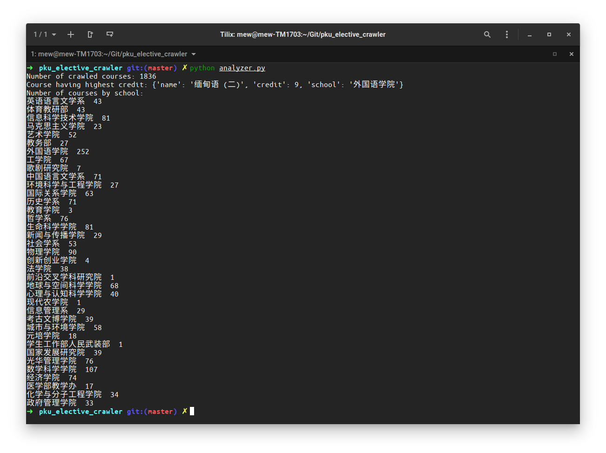

# 北大选课网爬虫

> 姓名：枚辉煌
>
> 学号：1800094810
>
> 日期：2021/05/15

- [北大选课网爬虫](#北大选课网爬虫)
  - [1. 爬虫选课页面 - crawler.py](#1-爬虫选课页面---crawlerpy)
  - [2. 获取课程数据 - converter.py](#2-获取课程数据---converterpy)
  - [3. 导入课程数据 - importer.py](#3-导入课程数据---importerpy)
  - [4. 读取与分析数据 - analyzer.py](#4-读取与分析数据---analyzerpy)

## 1. 爬虫选课页面 - crawler.py

我选择北大选课网为爬虫目标网站，网站地址为 [http://elective.pku.edu.cn/](http://elective.pku.edu.cn/)。在我开始写爬虫的时候能正常查询北大本学期开的课程，但现在选课网已经关闭查询课程功能，所以不能裁图说明爬虫过程，请谅解。

爬虫目标是获取北大本学期所开的课程，我获取课程的路径是 “培养方案” -> “添加到选课计划” 可以查询本学期所开的课程，但是已经选过和在培养方案的课程不在这里显示。

在工具栏可以选择课程类型，开课单位，开课时间等。我需要获取所有课程所以开课单位选择为“全部”，课程类型大概有六种：英语课，专业课、通选课、公选课、体育课、政治课、计算机基础课。

任选一个课程类型，例如“专业课”，然后点击 “查询”，可以发现选课网给后端提交一个表单，提交路径为

[https://elective.pku.edu.cn/elective2008/edu/pku/stu/elective/controller/courseQuery/getCurriculmByForm.do](https://elective.pku.edu.cn/elective2008/edu/pku/stu/elective/controller/courseQuery/getCurriculmByForm.do)

表单包含以下属性：

```python
'wlw-radio_button_group_key:{actionForm.courseSettingType}': 'speciality'
'{actionForm.courseID}': '',
'{actionForm.courseName}': '',
'wlw-select_key:{actionForm.deptID}OldValue': 'true',
'wlw-select_key:{actionForm.deptID}': 'ALL',
'wlw-select_key:{actionForm.courseDay}OldValue': 'true', 
'wlw-select_key:{actionForm.courseDay}': '',
'wlw-select_key:{actionForm.courseTime}OldValue': 'true',
'wlw-select_key:{actionForm.courseTime}': '',
'wlw-checkbox_key:{actionForm.queryDateFlag}OldValue': 'false',
'deptIdHide': 'ALL',
```

其中我们关注的是 `wlw-radio_button_group_key:{actionForm.courseSettingType}`，这个属性表示课程类型。继续选择其他课程类型可以发现它们对应关系为：

```
专业课：speciality
政治课：politics
英语课：english
体育课：gym
通选课：trans_choice
公选课：pub_choice
计算机基础课：liberal_computer
```

因此只需要替换这个属性就能获取某一类型的所有课程。但是查询结果会分页的，试试点击第二页，我发现它不提交表单了，而是给另外一个路径发送请求：

[https://elective.pku.edu.cn/elective2008/edu/pku/stu/elective/controller/courseQuery/queryCurriculum.jsp](https://elective.pku.edu.cn/elective2008/edu/pku/stu/elective/controller/courseQuery/queryCurriculum.jsp)

请求参数是 `netui_row: syllabusListGrid; 100`。因为每一页显示 100条结果，所以可以猜测这是 offset 的参数，但是后端怎么知道我在查询什么呢？我猜测是上次查询后端已经保存我查询课程的状态，所以根据请求的Cookie可以知道我上次发来的表单是什么样子。因此，每次获取特定类型的课程，我先给 `getCurriculmByForm.do` 发一个请求，然后再次给 `queryCurriculum.jsp` 修改 offset即可。

因为登录比较复杂，所以我就手动登录到选课网，然后将 Cookie贴在代码里面。具体实现请查看 `crawler.py`，其实现很简单的，只是用 `requests` 给上述两个路径发送请求，然后将html文件保存在`courses_html` 目录里面。

## 2. 获取课程数据 - converter.py

获取 html 文件之后，我用 `BeautifulSoup` 包解析每一个 html，转换数据到 json 格式。

课程时在表格 `<table>` 中的一行`<tr>`，其 class 分为 `datagrid-odd` 和 `datagrid-even` 两种。获取所有课程行代码

```python
rows = soup.find_all('tr', ['datagrid-odd', 'datagrid-even'])
```

课程各个属性，例如课程号、课程名、学分、开课单位等，按列表示在 `<td>` 中

```python
for row in rows:
    cols = row.find_all('td')
```

然后按照顺序获取所要的信息：课程号、课程名、学分、教师、开课单位。因为一门课会开很多班，每班由不同老师讲课，所以应该将这些班合并到一门课数据中。我用一个字典，其key为 (课程号，开课单位) 确定一门课的数据，然后将这个字典的 values 写到一个 json 文件中。json 文件可以在 `courses_data` 目录中查看。

## 3. 导入课程数据 - importer.py

我在本地使用 Docker 跑一个 MySQL container，其 database 名为 `elective_db`，然后用 `mysqlclient` 创建一个表 `course_tab` 有以下列：

```sql
id INT NOT NULL AUTO_INCREMENT, 
course_no VARCHAR(20) NOT NULL, 
name VARCHAR(100) NOT NULL, 
credit INT NOT NULL, 
type VARCHAR(10) NOT NULL, 
school_name VARCHAR(20) NOT NULL, 
PRIMARY KEY (id) 
```

然后简单地读取 json 文件，用 SQL 语句添加到数据库中，主要用到 mysqlclient 中的 `query()` 函数。

## 4. 读取与分析数据 - analyzer.py

这一部分简单地从数据库中读取数据，主要关注三点：

- 数据库中的课程数目

  ```sql
  SELECT COUNT(*) FROM course_tab;
  ```

- 学分最多的课程

  ```sql
  SELECT name, credit, school_name FROM course_tab ORDER BY credit DESC LIMIT 1;
  ```

- 按照院系列出开课数目

  ```sql
  SELECT school_name, COUNT(*) FROM course_tab GROUP BY school_name;
  ```

实现过程中使用 `MySQLdb` 的 `cursor()`，然后用 `execute()`, `fetchone()` 和 `fetchall()` 函数执行查询语句。 

**运行结果**



